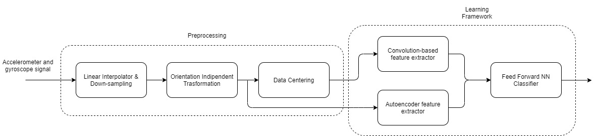

# Human Activity Recognition

> **ABSTRACT**. Using smartphones sensors for predicting the current
> activity performed by a user could be a very useful feature for most
> of fitness mobile apps out there. However, when dealing with cheap
> sensors and real use case scenarios, this task can easily become
> very challenging. A key question in particular is how to mitigate
> Human Activity Recognition (HAR) impairments in every day life
> smartphone usage. In this paper, we study the effects of
> smartphones' heterogeneity in state-of-the-art models, and propose
> solutions such as Orientation Independent Transform preprocessing
> techniques to mitigate them. Furthermore we investigate the benefits
> of combining automatic autoencoder extracted features in the best
> known model in literature nowadays, base upon Convolutional Neural
> Network (CNN). We then first test our architecture on Heterogeneity
> Dataset outperforming previous obtained results, and then test it on
> a new real use case collected dataset, obtaining in this case
> promising results.

> [Read the paper 🚀](https://github.com/lparolari/har/releases/latest/download/paper.pdf)

## Our Work

> Please refer to the [paper](https://github.com/lparolari/har/releases/latest/download/paper.pdf) for further details.

**Goal.** Perform Human Activity Recognition on "in-the-wild" data among five classes: `no_activity`, `walk`, `bike`, `stairsup`, `stairsdown`.

**Architecture.** We developed a novel framework composed by an Autoencoder for automatic extraction of statistical features and a Convolutional Neural Network for local feature extraction. The figure shows our architecture.



**Results.** With the main model on test data (from a brand new dataset) we got **85.3%** accuracy. This new dataset contained also signals recorded with phone in hands or poket. In those cases we got **70.5%** accuracy.

## Project Structure

The project is structured in two macro blocks: paper and notenooks.
The first contains Latex resources for the notebook related to the
project, while the second contains all Python code for our models.

In particular, our main notebook with up-to-date models are:

- `autoencoder_gridsearch.ipynb`, with the autoencoder model and KNN,
  FFNN classifiers with their evaluation and grid-searches (MAIN AE NOTEBOOK);
- `autoencoder_plot.ipynb`, `autoencoder_confusionmatrix.ipynb`, with
  confusion matrix and many plots for evaluating AE performances;
- `autoencoder_split.ipynb`, with a test on splitted data
  (accelerometer/gyroscope);
- `split_train_test_set.ipynb`, with the dataset preprocessing
  functions;
- `training_model_app.ipynb`, with the CNN model and it's evaluation;
- some util files with Python functions.

## Usage

**Start jupyter notebook with docker**

```
docker pull jupyter/tensorflow-notebook
docker run \
  -p 8888:8888 \
  -v "`pwd`:/home/jovyan/work" \
  jupyter/tensorflow-notebook start-notebook.sh \
    --NotebookApp.notebook_dir="/home/jovyan/work"
```

**Start jupyter notebook with docker and bind GPU device**

```
docker run \
  --device /dev/nvidia0:/dev/nvidia0 \
  --device /dev/nvidiactl:/dev/nvidiactl \
  --device /dev/nvidia-uvm:/dev/nvidia-uvm \
  -p 8888:8888 \
  -v "`pwd`:/home/jovyan/work" \
  jupyter/tensorflow-notebook start-notebook.sh \
    --NotebookApp.notebook_dir="/home/jovyan/work" \
    --NotebookApp.token=""
```

**Connect your IDE with jupyter**

Then connect the jupyter server with the notebook.

- If you use colab, click on _Connect_ button and enter the url given from the `docker run` command.
- If you use vscode, click on _Connect_, select _Existing server_ and enter the url given from the `docker run` command.

## Authors

**Bryan Lucchetta**

- Email: [bryan.lucchetta@gmail.com](bryanlucchetta@gmail.com)
- GitHub: [@1-coder](https://github.com/1-coder)

**Luca Parolari**

- Email: [luca.parolari23@gmail.com](mailto:luca.parolari23@gmail.com)
- GitHub: [@lparolari](https://github.com/lparolari)
- Telegram: [@lparolari](https://t.me/lparolari)

## License

The project is MIT licensed.
